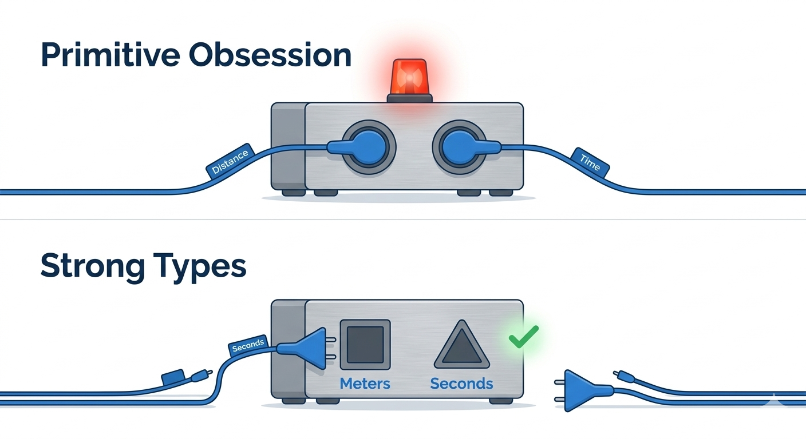
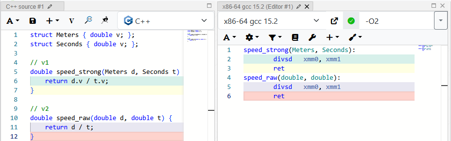

<a id="strong-types"></a>
# C++: Техники за пределами прикладного минимума. Часть 1. Сильные типы

<center>
  
</center>


- [C++: Техники за пределами прикладного минимума. Часть 1. Сильные типы](#c-техники-за-пределами-прикладного-минимума-часть-1-сильные-типы)
  - [Типовая задача: контроль порядка параметров](#типовая-задача-контроль-порядка-параметров)
  - [Возможности и области применения](#возможности-и-области-применения)
    - [1. Защита логики взаимодействия](#1-защита-логики-взаимодействия)
    - [2. Смысловая перегрузка интерфейсов](#2-смысловая-перегрузка-интерфейсов)
    - [3. Гибкий порядок параметров](#3-гибкий-порядок-параметров)
  - [Цена надежности и здравый смысл](#цена-надежности-и-здравый-смысл)
  - [Инструменты оптимизации: как платить меньше](#инструменты-оптимизации-как-платить-меньше)
    - [Уровень 1: Шаблоны (TypeWrapper)](#уровень-1-шаблоны-typewrapper)
    - [Интеграция в экосистему: std::hash](#интеграция-в-экосистему-stdhash)
    - [Уровень 2: Готовые библиотеки](#уровень-2-готовые-библиотеки)
    - [Прагматичный подход: когда стоит остановиться?](#прагматичный-подход-когда-стоит-остановиться)
  - [Что нам предлагают новые стандарты?](#что-нам-предлагают-новые-стандарты)
    - [Явная инициализация агрегатов](#явная-инициализация-агрегатов)
    - [Определяемые пользователем литералы](#определяемые-пользователем-литералы)
  - [Оглядываясь назад: анатомия простых деталей](#оглядываясь-назад-анатомия-простых-деталей)

---
**Цикл статей «Техники за пределами прикладного минимума»:**
1. **Часть 1. Сильные типы (вы здесь)**
2. [Часть 2. Tag Dispatching](../2_tag_dispatching/tag_dispatching.md)
3. [Часть 3. Type Traits](../3_type_traits/type_traits.md)
---

<a id="intro"></a>
Довольно давно в C++ сложилось негласное разделение на прикладную разработку и написание библиотек. Для многих прикладных программистов принцип «я не злоупотребляю шаблонами» стал признаком рационального подхода. Эту популярную позицию можно назвать «шаблонным минимализмом». Долгое время я и сам её придерживался, сознательно избегая приёмов, которые принято считать «слишком библиотечными». Однако со временем стало ясно, что такой минимализм нередко мешает видеть по-настоящему удачные решения. 

Исследование этого арсенала — техник за пределами привычного прикладного минимума, от которых часто отказываются по привычке, — стало темой данного цикла. Для кого-то подобные решения уже давно часть стандартной практики, для других — неоправданная магия. Здесь не устанавливаются жесткие правила. Цель — разобрать анатомию приёмов и понять, при каких условиях цена их внедрения окупается на практике.

Наш маршрут строится по принципу логической преемственности: от техник, которые органично вырастают из повседневного кода, к решениям, более характерным для разработки библиотек. В этой логике первым шагом становятся **Сильные типы** (**Strong Types**). Это логичный старт: группа простых решений, которые при минимальных затратах дают ощутимый эффект.

<habracut />

<details>
  <summary>Коротко о примерах и стандартах</summary>
  Примеры упрощены для демонстрации принципов. Мы начнем с классических подходов, а затем обсудим современные альтернативы из C++20/23. Цель — помочь читателю найти баланс между строгостью типов и простотой кода.

  Исходные коды всех примеров доступны в [репозитории на GitHub](https://github.com/ваш-ник/cpp-library-approach).
</details>


<a id="preventing-confusion"></a>
## Типовая задача: контроль порядка параметров

Возьмём распространённый случай: функцию с несколькими параметрами одинакового типа. Например, расчет скорости по расстоянию и времени. В коде это может выглядеть так:

```cpp
constexpr double speed(double d, double t) {
    return d / t;
}
```

Проблема здесь в том, что для компилятора оба параметра — просто числа. Мы можем легко ошибиться при вызове, и программа продолжит работать, выдавая неверный результат:

```cpp
void test() {
    double distance = 100.0;
    double time = 5.0;
    
    // Ошибка: перепутали порядок аргументов
    auto v = speed(time, distance); 
    
    // Компилятор не видит проблемы, логика нарушена.
}
```

Информация о том, что число означает именно «расстояние», существует только в голове разработчика — это знание остается на уровне «джентльменского соглашения» программиста с самим собой, в котором компилятор не участвует и не может гарантировать его соблюдение. Когда между объявлением переменных и точкой вызова лежат сотни строк кода или границы разных модулей, это знание легко теряется, а любая опечатка в порядке аргументов превращается в трудноуловимый баг. Способ сделать этот негласный договор явным, о котором далее пойдёт речь — зафиксировать смысл данных в самой системе типов. Это позволяет переложить рутинную проверку на компилятор, уменьшив человеческий фактор.

Псевдонимы типа вроде `using Meters = double` здесь не помогут — они лишь создают синоним, а не новый тип. Для компилятора это всё тот же `double`, и он всё так же позволит их перепутать. Чтобы получить по-настоящему разные сущности, нам нужны полноценные структуры:

<center>
  
  <br/>
  <i>Рис 1. Различимость типов: от анонимных чисел к именованным сущностям.</i>
</center>

```cpp
struct Meters {
    double value;
};

struct Seconds {
    double value;
};

// Теперь невозможно перепутать порядок аргументов:
[[nodiscard]] constexpr double speed(Meters d, Seconds t) {
    return d.value / t.value;
}

void test() {
    speed(Meters{25.0}, Seconds{5.0});
    // speed(Seconds{5.0}, Meters{25.0}); // Ошибка компиляции!
}
```

> **Важное уточнение:** Может возникнуть иллюзия, что «сильные типы» — это какая-то альтернатива именно примитивным типам (вроде `double` или `int`). На самом деле, речь идет о **различимости** типов для компилятора. Если ваша функция принимает аргументами три одинаковые структуры — мы имеем ту же проблему, что и с `double`. Сильные типы позволяют сделать разные по смыслу сущности разными для системы типов, даже если их внутреннее устройство идентично.

C++ сегодня — это язык производительности и развитых библиотек. Поэтому вопрос о рантайм-эффекте любой обертки возникает закономерно. Мы рассчитываем, что простое оборачивание данных в структуру не замедляет код. Это утверждение кажется привычным, но теорию всегда полезно подтверждать практикой. Заглянем в ассемблер: это лучшая иллюстрация того, что современный компилятор видит сквозь наши обертки так же легко, как и просто обычные числа:


<center>
  
  <br/>
  <i>Рис 2. В обоих случаях используется одна и та же инструкция divsd.</i>
</center>


<details>
  <summary>Техническое уточнение: Почему это бесплатно?</summary>

  Под «нулевой стоимостью» мы подразумеваем идентичность машинного кода для `double` и `Meters` при включенных оптимизациях (`-O2`). Чтобы магия работала, тип должен оставаться **тривиальным**:

  <ol>
    <li><b>Правило деструктора:</b> Не объявляйте пользовательский деструктор (даже пустой). Используйте <code>default</code> или доверьтесь компилятору. Это позволит передавать объект через регистры процессора, а не через память.</li>
    <li><b>Прозрачность:</b> Помечайте конструкторы и операторы как <code>constexpr</code> и <code>noexcept</code>. Это помогает компилятору «стирать» границы типов еще до генерации машинного кода.</li>
    <li><b>Об ABI и «бесплатности»:</b> Здесь есть важный нюанс. На <b>System V ABI</b> (Linux, macOS) структура with one <code>double</code> передается напрямую в XMM-регистре — это честный zero-cost. Однако в <b>Windows x64 ABI</b> любая структура размером 8 байт передается через целочисленный регистр (RCX). В результате внутри функции компилятору приходится вставлять инструкцию <code>movq</code> для перемещения данных в XMM-регистр. На практике это почти всегда нивелируется инлайнингом, но при раздельной компиляции «чистая» стоимость может незначительно отличаться от голого <code>double</code>.</li>
  </ol>
</details>

<a id="scaling-up"></a>
## Возможности и области применения

Защита от перепутанных аргументов — лишь первая из задач, которые решают сильные типы. Опытные практики могут сразу возразить: не пальба ли это из пушки по воробьям, — обёртка над каждым параметром функции ради одной проверки? Это и есть тот самый вопрос баланса, к которому мы еще вернемся. Но прежде чем взвешивать цену, давайте посмотрим на другие возможности сильных типов — те, что делают их чем-то большим, чем просто «страховкой» при передаче параметров в функцию.

<a id="logic-protection"></a>
### 1. Защита логики взаимодействия

Теперь что на вход функции попадают не безликие числа, а объекты разных классов, несущие конкретный смысл, это ещё одна возможность, - ограничить использование этих параметров уже внутри функции. 

Вместо того чтобы вручную следить за физическим смыслом каждой формулы, мы можем определить **роль** типа через набор разрешенных операций. В результате неверный код становится **невыразимым**: компилятор не просто «находит ошибку», он не находит способа собрать бессмысленное действие.

```cpp
struct Meters {
    double value;
    explicit constexpr Meters(double v) : value(v) {}
    explicit operator double() const { return value; }

    // Разрешаем только те действия, которые имеют смысл для этой сущности:
    Meters operator+(Meters other) const { return Meters{value + other.value}; }
    Meters operator-(Meters other) const { return Meters{value - other.value}; }
    
    // Любые другие взаимодействия (например, с Seconds) не прописаны, 
    // и компилятор заблокирует их автоматически.
};
```

Многим этот приём напомнит классическую инкапсуляцию, и это действительно так. Раз уж параметры стали объектами, у нас появляется выбор: либо использовать их просто как контейнеры, каждый раз доставая значения через `.value`, либо описать правила их взаимодействия в самих типах. Во втором случае часть контроля за логикой берет на себя компилятор.

**Однако ручное описание таких правил для каждой новой сущности требует времени.** Как мы видели на примере `Meters`, каждый оператор нужно прописывать явно. Если расчетов в проекте мало, а данные лишь передаются по цепочке вызовов без обработки, такая подготовка типов может привести к излишнему усложнению синтаксиса без реальной выгоды.

Чтобы почувствовать масштаб этой рутины, представьте, что вам нужно разграничить не две, а десятки сущностей: `Kilograms`, `Liters`, `Grams`… Для каждой структуры придется написать похожий блок:

```cpp
struct Kilograms {
    double v;
    Kilograms operator+(Kilograms o) const { return {v + o.v}; }
    bool operator==(Kilograms o) const { return v == o.v; }
    // ... и ещё 5-6 подобных операторов для каждой сущности
};
```

Если таких типов десятки, вы быстро получите сотни строк практически одинакового кода. На этом этапе легко допустить опечатку (например, забыть сменить возвращаемый тип при копировании оператора из одной структуры в другую), а объём сопутствующего кода начнёт обгонять саму логику. 

Эту рутину можно автоматизировать с помощью шаблонов (мы поговорим о том, как это устроено, в разделе «Инструменты оптимизации»), а пока рассмотрим еще одно преимущество разделения типов.

<a id="overloading-bonus"></a>
### 2. Смысловая перегрузка интерфейсов

Использование базовых типов для выражения разных бизнес-понятий известно как антипаттерн **Primitive Obsession** (одержимость примитивами). Проблема в том, что для компилятора разные по смыслу данные выглядят одинаково. Это лишает нас возможности использовать перегрузку и заставляет либо плодить громоздкие уникальные имена для каждой комбинации параметров, либо переходить к ветвлению во время исполнения:

```cpp
// Вариант БЕЗ сильных типов:
// Либо так (ветвление в рантайме):
double discount(double price, double value, bool is_percent);

// Либо так (уникальные имена для каждой комбинации):
double discount_by_percent(double price, double percent);
double discount_by_absolute(double price, double rubles);
```

Сильные типы предлагают третий путь: система типов сама выберет нужный алгоритм еще на этапе компиляции. Это позволяет избавиться от лишних флагов и ветвлений, передавая выбор нужной реализации компилятору:

```cpp
struct Price   { double value; };
struct Percent { double value; };
struct Rubles  { double value; };

// Разграничиваем логику скидок на уровне типов:
Price discount(Price p, Percent pct) {
    return Price{p.value * (1.0 - pct.value / 100.0)};
}

Price discount(Price p, Rubles off) {
    return Price{p.value - off.value};
}
```

<a id="flexible-order"></a>
### 3. Гибкий порядок параметров

Еще один эффект перегрузки — возможность сделать порядок параметров неважным. Это спорный, но иногда дающий уникальное удобство интерфейса приём:

```cpp
Price discount(Price p, Rubles off) { return Price{p.value - off.value}; }
Price discount(Rubles off, Price p) { return discount(p, off); }

void test() {
    Price p{1000.0};
    auto p1 = discount(p, Rubles{150.0}); 
    auto p2 = discount(Rubles{150.0}, p); // Оба варианта работают одинаково прозрачно
}
```

**Границы применимости.** Этот метод идеально работает для двух параметров. При увеличении числа аргументов количество перегрузок растет факториально. Для сложных функций с 3 — 4 параметрами эффективнее использовать паттерн Builder или именованные параметры. Сильные типы здесь — не замена архитектурным паттернам, а инструмент упрощения простых случаев.

<a id="rationality"></a>
## Цена надежности и здравый смысл

Как может выглядеть использование сильного типа в реальности? Мы уже рассматривали самый простой вариант со структурой и открытым полем. В новом, изолированном коде он вполне применим — когда вы полностью контролируете все точки вызова и уверены, что никто не подставит туда «сырое» число.

Однако в реальных проектах мы чаще имеем дело с рефакторингом. У вас уже есть сотни функций и тысячи строк кода, которые нужно адаптировать. Именно здесь возникает самый сильный соблазн — сделать сильные типы «прозрачными», добавив оператор неявного приведения к базовому типу. Это кажется быстрым способом «просто заставить всё работать», но на практике такая уступка часто сводит на нет всю защиту.

Проблема в том, что при наличии старых версий функций компилятор не остановит вас ошибкой. Если он не найдет точного совпадения для сильных типов (например, из-за ошибки в порядке), то просто «тихо» приведет объекты к числам и вызовет старый вариант API. В итоге ошибка в логике остается, а защита становится иллюзорной:

```cpp
// 1. Старое API
constexpr double speed(double d, double t) { return d / t; }

// 2. Новое API (перегрузка для сильных типов)
constexpr double speed(Meters d, Seconds t) { return d.value / t.value; }

void test() {
    Meters d{100.0}; Seconds t{5.0};
    speed(d, t); // Выберется (2)
    speed(t, d); // Ошибка: Meters не приводится к Seconds, но оба приводятся к double.
                 // Компилятор выберет старый вариант (1). Ошибки сборки не будет.
}
```

Чтобы гарантировать защиту, необходим `explicit`. Это наша своего рода **цена за безопасность**: вместе с ним приходится прописывать и операторы для защиты логики, о которых мы говорили выше. В сумме это всегда дополнительный код, и в масштабах проекта его объем может быть внушительным. Именно в этой точке вступает в дело инженерный расчет: как получить все плюсы контроля типов, не утонув в написании кода?

Выбор сильных типов зависит от множества обстоятельств. Но можно выделить наиболее ясные случаи — например, «бизнес-ключи» (UserId, OrderId) или физические величины. Здесь данные представляют логически несовместимые сущности: использование UserId вместо OrderId лишено смысла и всегда ведет к ошибке. Именно в таких точках «говорящие» типы приносят максимум пользы, блокируя случайную подмену данных еще при сборке.

<a id="optimization"></a>
## Инструменты оптимизации: как платить меньше

Прописывание операторов вручную для каждой сущности быстро превращается в рутину. Рациональный путь — использовать инструменты, позволяющие получить все плюсы, минимизируя написание кода.

<a id="templates-simplification"></a>
### Уровень 1: Шаблоны (TypeWrapper)

Чтобы не прописывать операторы для каждой сущности вручную, логично вынести общую часть в шаблон. В самом простом виде он выглядит так:

```cpp
template <typename T, typename Tag>
struct TypeWrapper {
    T value;

    explicit constexpr TypeWrapper(T v) : value(v) {}
    explicit constexpr operator T() const { return value; }
};
```

На первый взгляд, анатомия этого шаблона элементарна:
1.  **Полезная нагрузка (`T value`)** — те самые данные (число), с которыми мы работаем.
2.  **Общая оболочка** — код самого шаблона, который задаёт правила поведения (конструкторы, операторы) один раз для всех.

Но здесь есть и третий элемент, который и делает всю схему рабочей: параметр **`Tag`**. 

В привычном прикладном программировании мы привыкли, что тип — это «чертёж» объекта: у него есть поля, методы или хотя бы размер. Даже когда мы используем типы в шаблонах, мы ждём от них информации. В `std::vector<int>` тип `int` говорит вектору, сколько памяти выделить и как копировать элементы. В `std::map<Key, Value>` типы определяют, как сравнивать ключи.

Здесь же мы используем **пустую структуру**, в которой нет ничего. Она не несёт данных, не занимает места и никак не влияет на работу процессора. 

Это принципиальный момент: мы используем тип не ради его содержимого, а исключительно ради его **идентичности**. Для компилятора `TypeWrapper<double, MetersTag>` и `TypeWrapper<double, SecondsTag>` — это две абсолютно разные, несовместимые вселенные, просто потому что у них разные «паспорта»-теги.

Такое использование типа как «маркера» или «имени» — одна из ключевых идей, которые лежат за границей привычного минимума. Это переход от программирования *данными* к программированию *информацией о типах*. Именно эта «пустота» тега позволяет нам масштабировать систему, создавая новые сущности простым объявлением имени.

<center>
  
  <br/>
  <i>Рис 3. Анатомия TypeWrapper: разделение данных (T) и уникальной метки (Tag).</i>
</center>

Теперь создание нового типа сводится к объявлению тега и псевдонима:

```cpp
struct MetersTag {};
using Meters = TypeWrapper<double, MetersTag>;

void func(Meters m) {
    // Безопасность есть, но удобства мало: нужен каст или .value
    std::cout << static_cast<double>(m) << " m" << std::endl;
}
```


<a id="std-hash"></a>
### Интеграция в экосистему: std::hash

Специализация `std::hash` — это продолжение идеи защиты логики. В то время как мы ограничиваем арифметику (чтобы не складывать метры с секундами), мы часто хотим использовать сильные типы как ключи в контейнерах. Один шаблонный блок делает все наши типы «первоклассными гражданами» стандартной библиотеки:

```cpp
namespace std {
    template <typename T, typename Tag>
    struct hash<TypeWrapper<T, Tag>> {
        size_t operator()(const TypeWrapper<T, Tag>& w) const {
            return std::hash<T>{}(static_cast<T>(w));
        }
    };
}
```

Обратите внимание на саму механику расширения: мы работаем с шаблонами с двух сторон. С одной стороны — мы можем расширять функционал самого `TypeWrapper` (например, добавляя в него операторы). С другой — мы реализуем внешний шаблон, который параметризован нашим шаблоном. 

Это пример того, как система типов C++ позволяет научить стандартную библиотеку работать с вашими абстракциями. Простая обертка начинает поддерживаться стандартными инструментами (например, контейнерами) наравне with базовыми типами.


Эта реализация — лишь концептуальный каркас. Она защищает интерфейсы, но требует ручного прописывания операторов. С ростом количества типов такой подход перестает быть эффективным, и на смену ему приходят готовые решения.

<a id="libraries"></a>
### Уровень 2: Готовые библиотеки

Что делать, если типов становятся десятки, а задачи выходят за рамки простого контроля параметров? Здесь на смену ручному проектированию приходят готовые решения (вроде [NamedType](https://github.com/joboccara/NamedType), [strong_type](https://github.com/rollbear/strong_type) или [type_safe](https://github.com/foonathan/type_safe)). Мы лишь бегло коснемся их возможностей, чтобы увидеть горизонт применения приёма.

Профессиональные библиотеки — это не только способ избежать рутины через **навыки** (skills). Они позволяют **собирать тип декларативно**: библиотека скрывает низкоуровневые детали реализации метапрограммирования, предоставляя вам чистый интерфейс. Вы просто перечисляете необходимые возможности:

*   **Безопасная индексация:** Позволяет создавать типизированные индексы. Вы не сможете случайно использовать `CustomerId` там, где ожидается `OrderId`. Да, это потребует явного приведения типа при обращении к массиву, но это и есть та самая контролируемая граница:

<details>
  <summary>Как это выглядит на практике?</summary>

```cpp
using OrderId = TypeWrapper<std::size_t, struct OrderTag>;
using CustomerId = TypeWrapper<std::size_t, struct CustomerTag>;

std::vector<Order> orders;
OrderId o_id{10};
CustomerId c_id{5};

// Явный каст — это подтверждение намерения. 
// Мы не можем просто подставить c_id вместо индекса заказа.
auto& item = orders[static_cast<std::size_t>(o_id)]; 

// orders[c_id]; // ОШИБКА: CustomerId не приводится к size_t автоматически
```
</details>
*   **Самодокументированные результаты:** Вместо возврата анонимных пар или кортежей функции возвращают структуры с понятными, строго типизированными полями.
*   **Сложная арифметика и Mixins:** Навыки вроде `Comparable`, `Hashable` или `Arithmetic` позволяют декларативно собрать тип, который ведет себя как полноценное число, сохраняя при этом безопасность.

```cpp
// Пример декларативной сборки типа с нужными навыками (библиотека NamedType)
using Width = fluent::NamedType<
    double, struct WidthTag, fluent::Addable, fluent::Printable
>;

void test() {
    Width w1{10.0}, w2{20.0};
    auto total = w1 + w2; // Оператор + добавился автоматически через навык Addable
    std::cout << total;   // Вывод в поток заработал через навык Printable
}
```

<details>
  <summary>На что еще можно посмотреть (Библиотеки)</summary>
  <ul>
    <li><b>NamedType</b> — фокус на выразительности интерфейсов и «именованных параметрах».</li>
    <li><b>strong_type</b> — мощный инструментарий для сложной математики (разграничение векторов, точек и т. д.).</li>
    <li><b>type_safe</b> — для тех, кому важна максимальная строгость: запрет неявных потерь точности и переполнений.</li>
  </ul>
</details>

<details>
  <summary>Почему статья не затрагивает эти темы глубоко?</summary>

  Нам сейчас важно увидеть само пространство возможностей этого приёма — вплоть до тех решений, которые предлагают готовые библиотеки. Но детальная реализация того же NamedType или strong_type опирается на темы, которые еще не разбирались. 

  Это уровень библиотечного проектирования со своим инструментарием. Внутреннее устройство подобных решений — тема для отдельного разговора, сейчас же важнее сосредоточиться на возможностях, которые они открывают. К разбору необходимых техник мы перейдем в следующих частях цикла.
</details>

<a id="pragmatic-balance"></a>
### Прагматичный подход: когда стоит остановиться?

Расширение арсенала «библиотечными» приёмами — это не попытка превратить весь проект в нагромождение шаблонов, а поиск способов сделать его правила более явными. Чтобы такие инструменты действительно помогали в повседневных задачах, а не становились поводом для конфликтов на ревью, важно нащупать границы их эффективности. Глядя на примеры выше — от простых ручных структур до мощных библиотек — можно заметить, что любая степень защиты требует своего уровня «синтаксических затрат». Чтобы эти затраты не перекрыли пользу от инструмента, на практике полезно опираться на несколько наблюдений:

*   **Ограничения «гибкого порядка»:** Не стоит внедрять сильные типы ради того, чтобы сделать порядок аргументов неважным, если их больше двух. Как мы видели, количество перегрузок в этом случае растет факториально, и «магия» удобства быстро превращается в нагромождение дублирующего кода.
*   **Когда шум мешает логике:** Если код тонет в бесконечных `.value()`, кастах или вызовах конструкторов, и за ними теряется суть самой операции — значит, оберток стало слишком много. Безопасность не должна мешать чтению.
*   **Когда параметр всего один:** Если функция принимает только одно число (например, цену или таймаут) и перепутать его в списке аргументов не с чем, сильный тип часто добавляет лишние действия без реальной выгоды.
*   **Когда хочется «срезать углы»:** Если при рефакторинге вы ловите себя на желании сделать приведения типов неявными, чтобы код «просто собрался», — это верный признак, что в данном месте сильные типы скорее мешают, чем помогают. Имитация защиты хуже её отсутствия.

В конечном итоге, сильные типы — это способ договориться с компилятором о проверке ваших намерений. И как в любых переговорах, здесь важно вовремя остановиться, сохранив баланс между строгостью и здравым смыслом.

<a id="new-standards"></a>
## Что нам предлагают новые стандарты?

Насколько эти техники актуальны в эпоху C++20/23? Разберем, как классические обертки взаимодействуют с новыми возможностями стандартов и где они продолжают дополнять друг друга.

<a id="designated-initializers"></a>
### Явная инициализация агрегатов
В C++20 появились «designated initializers», позволяющие указывать имена полей при инициализации структур. Именованная инициализация снимает вопрос о том, какое значение к какому полю относится:

```cpp
struct Area {
    double width;
    double height;
};

Area a{ .width = 10.0, .height = 20.0 };
```

Такой синтаксис помогает в момент создания структуры, но он бессилен, если функции продолжают принимать «голые» типы. Однако Designated Initializers открывают путь к прагматичному компромиссу — паттерну **Parameter Object**. 

Если функция принимает, к примеру, 5 параметров одинакового типа, создание сильной обертки для каждого может показаться избыточным. В этом случае можно объединить их в одну структуру-агрегат:

```cpp
struct SpeedParams {
    double distance;
    double time;
};

double speed(SpeedParams p) {
    return p.distance / p.time;
}

// Вызов стал наглядным и безопасным:
speed({.distance = 100.0, .time = 5.0});
```

Такой синтаксис помогает не ошибиться при вызове функции: благодаря именам полей (`.distance`, `.time`) практически невозможно передать значения в неправильном порядке. В отличие от языка C, стандарт C++20 строго требует, чтобы порядок инициализаторов **совпадал с порядком объявления полей** в структуре.

Однако важно понимать: этот способ защищает только в момент вызова. Внутри самой функции поля структуры остаются обычными числами. Компилятор не помешает вам случайно вычесть время из расстояния, если вы ошибётесь в формуле. В этом и есть главное отличие от сильных типов: структура защищает порядок данных при передаче (call-site safety), но не их смысл при использовании (domain safety). 

Таким образом, Designated Initializers — отличное подспорье для простых структур и объектов конфигурации, но они решают лишь часть проблем и не являются полной заменой сильным типам.

<a id="udl"></a>
### Определяемые пользователем литералы

А здесь современные возможности не конкурируют с приёмом, а становятся для него логиным дополнением.
 Литералы (User-Defined Literals, UDL) — это эффективный инструмент для соблюдения упомянутого выше **принципа прозрачности логики**. Они позволяют вернуть коду лаконичность, сохраняя наглядность на уровне обычных чисел, но при этом полностью используя преимущества сильных типов:

```cpp
struct Meters {
    double value;
};

// Литералы с плавающей точкой должны принимать long double (стандарт), 
// внутри мы приводим его к нашему рабочему double:
constexpr Meters operator"" _m(long double x) {
    return Meters{static_cast<double>(x)};
}

void test() {
    // Безопасно, лаконично и наглядно:
    std::cout << speed(10.0_m, 5.0_s) << "\n";
}
```

**Какова цена этого удобства?**
Во-первых, это ручной труд: для каждой единицы измерения (`_m`, `_km`, `_s`) придется прописать отдельную функцию-оператор. Ожидать от литералов поддержки сложных составных объектов было бы неоправданно — это всё равно что требовать от лодки быстрой езды по суше. Литералы созданы, чтобы наделять базовые типы (числа, строки) семантическим контекстом, делая их использование максимально естественным. Это отличный способ «сгладить углы» там, где смысл выражен через простые значения.

Об оптимизации размера пустых типов (включая атрибут `[[no_unique_address]]`) мы подробно поговорим в следующей части, так как именно там тэги начинают играть активную роль.

<a id="conclusion"></a>
## Оглядываясь назад: анатомия простых деталей

Мы сделали первый шаг от прикладного программирования к библиотечному. Важно было увидеть, что за пределами привычного минимума нас ждут не монолитные «магические» решения, а комбинация понятных элементов:

1.  **Шаблоны классов** (универсальный каркас) — отделение логики реализации от конкретной идентичности типа.
2.  **Перегрузка функций** (таблица решений) — выбор поведения еще на этапе компиляции.
3.  **Пустой тип** (маркер смысла) — практически не имеет накладных расходов в рантайме (подробнее об их оптимизации мы поговорим в следующей части).

Разбор такой «анатомии» помогает увидеть за сложным приёмом взаимодействие простых деталей и перестать воспринимать подобные техники как неприступный монолит. Из этого списка лишь пустые типы редко встречаются в прикладном коде, так и должно быть, — дальше мы увидим, что и другие решения строятся из подобных элементов, а их основа во многом повторяется.

Сейчас мы посмотрели, как использовать теги для безопасности интерфейсов. В следующей части мы попробуем заставить эти же «пустые структуры» работать активно. Мы поговорим о **Tag Dispatching** — технике, которая позволяет управлять самим ходом вычислений, выбирая нужные алгоритмы еще на этапе компиляции.

Жду ваших мыслей в комментариях: где, по-вашему, проходит граница между «полезной строгостью» и «избыточным усложнением»? Стоит ли «входной билет» в виде дополнительных структур того, чтобы платить его в ваших реальных проектах?
